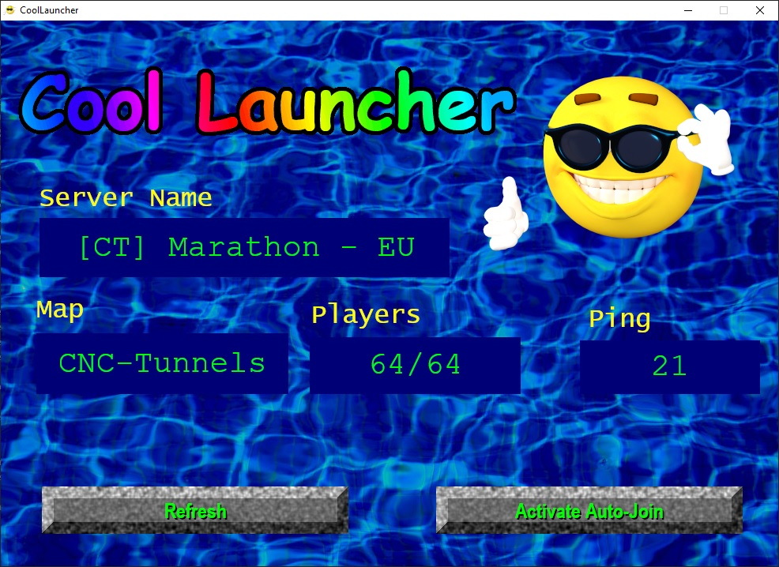

# CoolLauncher

An alternative launcher for Renegade X.

## Why?

The Renegade X community only ever manages to fill up one server. We all want to play on that one server. Hence CoolLauncher. CoolLauncher only shows you one single server (the one with the most players) and - if that server is full - the *Join*-Button conveniently changes to an *Activate Auto-Join*-button that allows you to get in **queue** for that server. CoolLauncher will then periodically check if a spot opened up and if so plays a cool notifcation sound (Oh yeah!) and starts Renegade X and joins that server automatically. It should be called CoolestLauncher really.

## I'm not gonna launch some random .exe downloaded off the internet

I'm glad you're taking your gaming & jerk-off station's security serious. That's why this launcher is completely open source. You can check the sauce code yoself or ask someone who knows basic JavaScript to check it for you (but srlsy it's 2022, learn some JavaScript n00b).

If you are uncomfortable with launching random .exe files anyway, you can:

1. Download and install the node package manager (npm) from [https://www.npmjs.com/](https://www.npmjs.com/) and restart your system (srlsy don't skip this step, this is important).
2. Download the CoolLauncher off of GitHub and and unzip it .
3. Open the CoolLauncher directory in the windows terminal.
4. Type `npm install` and wait for the required packages to be installed.
5. Type `npm start` to start the CoolLauncher. Oh yeah!

## Change log

## v0.1

- The Cool Launcher logo is now animated.

## v0.2

- Cool Guy's Shades are now tinted a cool orange
- Updated deprecated realm list url

## Assets

All art and sound assets are CC0 except for the cool emoji (coolguy2.png) which is created by TheDigitalArtist and published under the Pixabay License [https://pixabay.com/illustrations/emoticon-emoji-smile-face-icon-1610518/](https://pixabay.com/illustrations/emoticon-emoji-smile-face-icon-1610518/).
